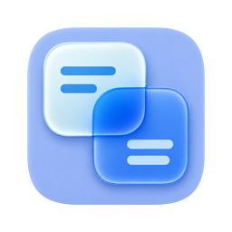

  

<h1 align="center">TSX · Translate X</h1>

为 Mac 而生的翻译工具。选中文字，读懂内容，继续工作。

  简体中文 · <a href="README.en.md">English</a>

**TSX 1.2.0 · 免费、开源的 Mac 翻译工具。** 本仓库统一提供应用源码、使用说明、问题反馈和正式安装包。

[版本与下载](https://github.com/TheoYuuu/tsx/releases) · [使用说明](Docs/USAGE.md) · [隐私与数据说明](Docs/PRIVACY.md) · [反馈问题](https://github.com/TheoYuuu/tsx/issues/new/choose)

## 更顺手的日常翻译

- **选中文字，即时翻译**：用快捷键翻译其他应用中的选中文字，通过浮窗查看结果。
- **截图识别与翻译**：框选屏幕区域，在本机识别文字；可查看文字结果，或在原图位置对照译文。
- **双向编辑**：编辑原文或译文，按需开启自动互译；支持语言切换、复制和撤销。
- **Apple 本地翻译优先**：使用系统翻译能力，语言包准备完成后可在本机翻译支持的语言。
- **按需选择服务**：可自行配置第三方翻译 API、兼容接口或本地模型服务。
- **融入 Mac**：菜单栏入口、自定义快捷键、中英文界面，以及浅色、深色与玻璃外观。

版本变化和已知问题见 Release 说明；取词效果取决于来源应用是否提供可读取的文字选区。

## 系统与服务

- 需要 **macOS 15 或更新版本**，通用安装包包含 Apple silicon 和 Intel 架构。
- Apple 翻译支持的语言以系统实际提供的列表为准；首次使用某些语言可能需要联网下载语言包。
- 第三方服务由你主动配置，可能需要独立的 API Key、账号、额度或付费；服务商会收到提交给它的翻译文本。
- 本地模型是否完全离线取决于你所配置服务的实际行为。

## 下载与更新

从 [最新 Release](https://github.com/TheoYuuu/tsx/releases/latest) 下载 **TSX-1.2.0-macOS-universal.dmg**，打开后将 TSX 拖入 Applications。正式安装包使用 Developer ID 签名并通过 Apple 公证。

GitHub 自动生成的 **Source code (zip / tar.gz)** 包含对应版本的项目源码，**不是可以直接安装的 TSX 应用**。请下载 Release 附件中的安装包。

在应用菜单或「设置 → 关于」中选择「检查更新」。应用启动时检查新版本，默认不下载安装；开启「自动更新」后会下载、安装并重启。退出更新前，请复制需要保留的原文和译文。也可在 GitHub 的 **Watch → Custom → Releases** 中订阅通知。

[官网产品页](https://lumaxspace.com/zh/products/tsx/) · [构建与发布流程](Docs/RELEASING.md)

## 反馈与项目状态

欢迎通过 [Issues](https://github.com/TheoYuuu/tsx/issues/new/choose) 提交问题或功能建议，中英文均可。提交前请检查相似问题，并使用不含私人内容的样例。

TSX 官方版本永久免费，不设置付费功能或订阅。你主动配置的第三方服务仍可能按其自身规则收费。项目采用 [MIT 许可证](LICENSE)，第三方组件保留各自许可证和声明。

## 参与开发

产品名称为 **TSX**；Xcode 工程、Scheme、Swift 模块和源码目录统一使用 `TranslateX`，测试使用 `TranslateXTests`。稳定应用身份与旧存储兼容标识见[分发说明](Docs/Distribution.md#应用身份与存储兼容)。

项目使用 Swift 6、AppKit 与 SwiftUI，并包含可选账号服务所需的 Rust 组件。请先阅读[源码构建说明](Docs/BUILDING.md)、[开发约定](AGENTS.md)、[公开仓库规范](Docs/PUBLIC_REPOSITORY.md)和[第三方声明](THIRD_PARTY_NOTICES.md)。最低部署目标为 macOS 15；Intel 与最低系统真机覆盖仍有限，完整范围见[验证记录](Docs/Validation.md)。

## 源码与反馈

本仓库提供可构建的 MIT 开源源码，并保留后续公开版本的变更记录。初始源码快照对应现有正式发行的应用代码与构建输入；仓库整理未重新构建或替换安装包。

欢迎通过 Issue 反馈问题与建议。本仓库不接受 Pull Request，PR 功能已关闭，代码仅由维护者提交。反馈请使用构造测试数据，避免真实账号、截图、私人路径或凭据；参阅[公开仓库规范](Docs/PUBLIC_REPOSITORY.md)。
